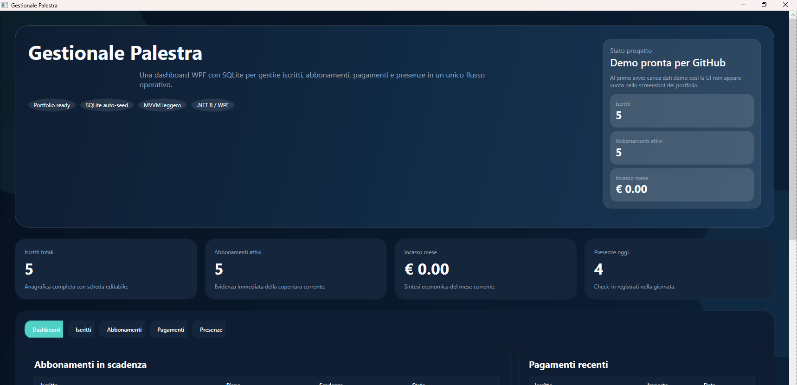
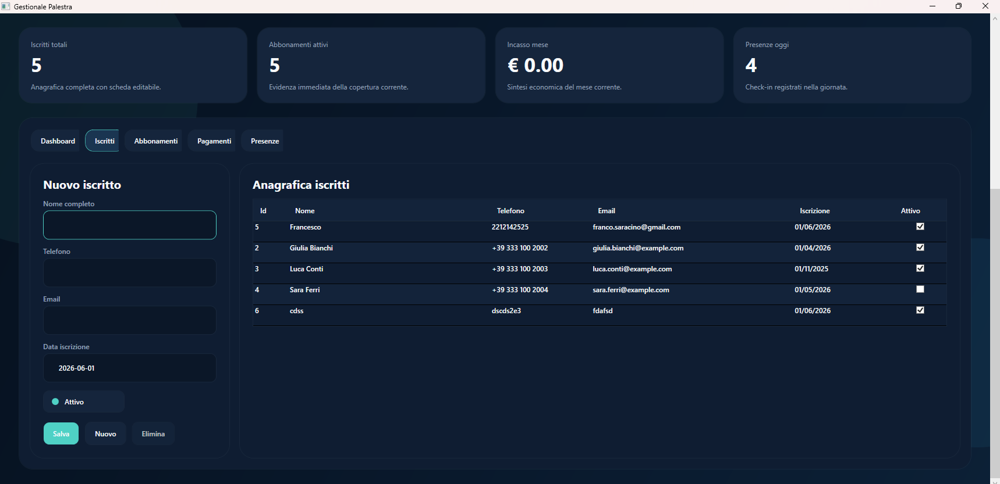
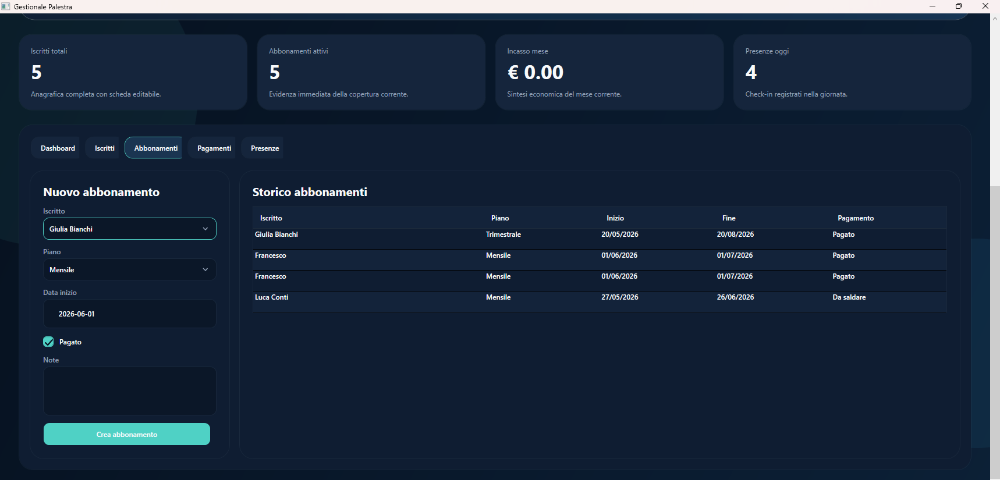

# Gestionale Palestra

Gestionale desktop in WPF per la gestione di una palestra, pensato come progetto portfolio da pubblicare su GitHub.

L'obiettivo del progetto e mostrare una UI moderna, una struttura ordinata in MVVM e un flusso realistico per anagrafiche, abbonamenti, pagamenti e presenze.

## Funzionalita

- gestione iscritti con form di inserimento, modifica ed eliminazione
- gestione piani di abbonamento
- creazione di nuovi abbonamenti associati a un iscritto
- registrazione pagamenti
- registrazione check-in presenze
- dashboard con metriche principali
- elenco abbonamenti in scadenza
- database SQLite creato automaticamente al primo avvio
- dati demo iniziali per mostrare subito l'interfaccia nel portfolio

## Screenshot

### Dashboard



### Iscritti



### Abbonamenti



## Tecnologie

- C#
- .NET 10
- WPF
- SQLite
- MVVM leggero

## Requisiti

Per eseguire il progetto serve:

- Windows
- .NET 10 SDK
- Visual Studio 2022/2025 oppure il comando `dotnet` da terminale

## Come aprire il progetto

### Opzione 1: Visual Studio

1. Apri `GestionalePalestra.sln`
2. Attendi il restore dei pacchetti NuGet
3. Avvia il progetto con `F5` oppure `Ctrl + F5`

### Opzione 2: Terminale

Apri un terminale nella cartella del progetto e lancia:

```powershell
dotnet build
dotnet run
```

Se vuoi avviare direttamente l'eseguibile compilato:

```powershell
.\bin\Debug\net10.0-windows\GestionalePalestra.exe
```

## Primo avvio

Al primo avvio:

- viene creato automaticamente il file SQLite locale
- vengono creati i tavoli del database
- vengono inseriti dati demo se il database e vuoto

Questo rende il progetto subito presentabile su GitHub senza dover inserire manualmente record prima di fare screenshot.

## Credenziali e login

Il progetto non include ancora un sistema di autenticazione.

Per ora e una demo single-window pensata per mostrare:

- UI
- flusso dati
- architettura
- potenziale da portfolio

## Struttura del progetto

- `App.xaml` e `App.xaml.cs`: avvio applicazione, tema globale e bootstrap del database
- `MainWindow.xaml` e `MainWindow.xaml.cs`: interfaccia principale
- `Data/`: accesso ai dati e logica SQLite
- `Models/`: modelli di dominio
- `ViewModels/`: logica della UI e binding
- `Infrastructure/`: utility MVVM come `ObservableObject` e `RelayCommand`

## Database

Il database viene creato localmente nella cartella di esecuzione dell'applicazione.

I dati principali gestiti sono:

- Members
- MembershipPlans
- Memberships
- Payments
- Attendances

## Workflow dell'app

1. L'app si avvia
2. Viene inizializzato SQLite
3. Se il database e vuoto, vengono inseriti dati demo
4. La dashboard mostra KPI e record reali
5. L'utente puo aggiungere o modificare iscritti, abbonamenti, pagamenti e presenze

## Funzionalita della UI

- layout a schede con navigazione chiara
- stile scuro coerente
- dashboard con card KPI
- tabelle dati con griglie leggibili
- form laterali per inserimento rapido
- stato degli abbonamenti e pagamenti in evidenza

## Roadmap

- login con ruoli
- esportazione Excel
- grafici mensili
- backup del database
- filtri e ricerca avanzata
- tema chiaro/scuro selezionabile
